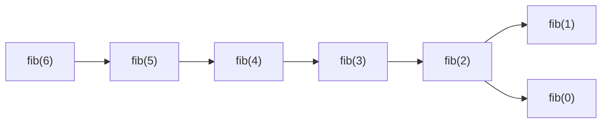

# Dynamic Programming
Advent of Code 2023 has just kicked off, and I'm going to try something a bit
different this year, I'm going to try and share useful concepts and patterns
that play a role in solving each day's puzzle.

Today, we're looking at how you can use dynamic programming to save yourself
a lot of computation, and how I spot and reason my way towards solutions in
this space.

<!-- more -->

## Dynamic Programming
Dynamic programming was always a sore point for me, one of those patterns that
I could identify when I saw it, but which I consistently struggled to reason
my way towards using. Speaking with others, that's a pretty common experience,
and with Advent of Code 2023 Day 4 being a great case for using it, I thought
I'd share what it is, and how you can start to use it too.

So, let's start out with recursion. "Recursion?!" you ask incredulously, "I
thought this was about dynamic programming?". Okay fine, you caught me, but
it turns out that dynamic programming is really recursion in a heavy coat.
So, as I was saying, let's start out with recursion.

### Recursion
Recursion is a pattern that most of us learn early on in our programming
careers, and it's a particularly useful pattern for decomposing complex
problems into simpler ones. Let's take calculating the Fibonacci sequence
for example.

::: tip
The Fibonacci sequence is a sequence of numbers where each number is the sum
of the previous two numbers in the sequence. The first two numbers in the
sequence are 0 and 1, and the sequence continues indefinitely, going 0, 1, 1,
2, 3, 5, 8, 13, 21, 34, 55, ...
:::

So, let's define that recursively:

```rust
fn fibonacci(n: u32) -> u32 {
    match n {
        0 => 0,
        1 => 1,
        _ => fibonacci(n - 1) + fibonacci(n - 2),
    }
}
```

Okay, great, we're done! We can easily calculate the Fibonacci sequence for
any number we want. Here, let me show you:

```
0 took 0.0ms
1 took 0.0ms
2 took 0.0ms
...
20 took 1.5ms
...
30 took 210ms
...
40 took 27s
```

Huh, okay that's not working out so well. I'm going to need to update my statement
to say that we can easily calculate the Fibonacci sequence for any number we want,
so long as you are willing to wait a very long time for the result.

So what's happening here? Well, if you look at the call graph for running the method
above, you'll see something like the following:

```mermaid: A diagram showing how recursively calculating Fibonacci(6) results in re-computing values multiple times.
graph LR
    fib_6["fib(6) x1"] --> fib_5
    fib_6 --> fib_4

    fib_5["fib(5) x2"] --> fib_4
    fib_5 --> fib_3

    fib_4["fib(4) x3"] --> fib_3
    fib_4 --> fib_2

    fib_3["fib(3) x5"] --> fib_2
    fib_3 --> fib_1
    
    fib_2["fib(2) x8"] --> fib_1["fib(1) x13"]
    fib_2 --> fib_0["fib(0) x8"]
```

You'll notice that because of the recursive nature of the algorithm, we end up
calling functions at the bottom of the tree multiple times. In fact, if you look
at the call patterns, you'll see that we end up that each additional number results
in a fibonacci number of increased calls to the next function down.

So, how can we fix this? Well, we can use a technique called memoization to cache
the results of previous calls to the function, essentially trading increased memory
usage for reduced computation time.

### Memoization
Memoization is a technique that involves caching the results of previous calls to
a function, and returning the cached result if the function is called again with
the same arguments. In general you'll find it implemented as a wrapper around the
function you want to memoize and it is often (but not always) implemented using some
kind of dictionary.

```rust
struct Fibonacci {
    cache: HashMap<u32, u32>,
}

impl Fibonacci {
    fn new() -> Self {
        Self {
            cache: HashMap::new(),
        }
    }

    fn fibonacci(&mut self, n: u32) -> u32 {
        match n {
            0 => 0,
            1 => 1,
            _ => {
                *self.cache.entry(&n).or_insert_with(|| {
                    self.fibonacci(n - 1) + self.fibonacci(n - 2)
                })
            }
        }
    }
}
```

Now when we run our code, we store the results of each call in our cache and can shortcut the
need to re-compute them in future. The result is that each additional number in the sequence
adds a constant amount of additional computational work, rather than an exponential amount.
Effectively, we've gone from an `O(n^2)` algorithm to an `O(n)` algorithm.

The trouble that we're going to run into, however, is that as we start to get to larger numbers
we're going to see our call stack grow beyond our stack size limit. We could configure our application
to have a larger stack, but eventually this just doesn't scale.

Instead, we'd really rather convert this from a recursive algorithm (which relies on these extra call
stacks) to an iterative algorithm (which doesn't, and can therefore be much faster).

### Iteration
When it comes to converting a recursive algorithm to an iterative one, the main trick is to spot
where the recursion results in an extra step being performed and look at how we can inline that.
Regardless of what we do, we're going to end up with a loop of some kind, and for trivial recursion
(where you call the same function only once), it's usually a trivial exercise.

Our Fibonacci example isn't one of these cases, you'll notice that we call ourselves twice and that
immediately throws a spanner in the works. But if we look carefully, you'll see that if we write out
the order of calls, you get something like the following:



That's a nice sequence of incrementing calls, which looks an awful lot like a loop. The only trick
is that we need to have filled in the right hand side values before the left hand side gets there,
and then we can use those. So let's try that:

```rust
fn fibonacci(n: u32) -> u32 {
    let mut cache = HashMap::new();

    cache.insert(0, 0);
    cache.insert(1, 1);

    for i in 2..n+1 {
        cache.insert(i, cache.get(&(i - 1)).unwrap() + cache.get(&(i - 2)).unwrap());
    }

    *cache.get(&n).unwrap()
}
```

Which brings us neatly back to our original topic, dynamic programming.

### Dynamic Programming
When it comes to dynamic programming, we're usually going to find ourselves converting a recursive
problem into a linear one, and then taking advantage of the linear steps to act as cache keys. The
beauty of using your steps as the cache keys is that they are linear increasing integer values, making
them work really well with arrays.

::: tip
Just because dictionaries and arrays both cost `O(1)` for lookups, doesn't mean that the constant cost
is the same, in fact dictionary lookups are almost universally slower than array lookups by several orders
of magnitude, so if you're able to use an array, you really should.
:::

Looking to our Fibonacci example, we can write the dynamic programming example as follows:

```rust
fn fibonacci(n: usize) -> u32 {
    if n < 2 {
        return n;
    }

    let mut cache = vec![0; n + 1];
    cache[1] = 1;

    for i in 2..n+1 {
        cache[i] = cache[i - 1] + cache[i - 2];
    }

    cache[n]
}
```

Something interesting that you'll note about this example is that we're initializing our cache with its
full size from the start. When it come to high performance algorithms, re-allocating memory is one of the
biggest sources of latency as the operating system needs to find a block of memory that's large enough
to fit your request, and we then need to copy any existing data into the new block. By allocating the
full size of the cache up front, we avoid this problem entirely (paying the `malloc` cost once, rather than
a logarithmic number of times as a dynamic vector expands).

### Optimizing Further
At this point, you've got an extremely fast dynamic programming solution to the Fibonacci problem, but
we can take this a step further by leveraging the insight that we only ever need the last two values.
As a result, storing the full cache is a waste of memory, and we can refactor our code to instead only
keep the most recent two values in memory.

```rust
fn fibonacci(n: u32) -> u32 {
    if n < 2 {
        return n;
    }

    let mut last = 0;
    let mut current = 1;

    for _ in 2..n+1 {
        let next = current + last;
        last = current;
        current = next;
    }

    current
}
```

Not only does this approach save a bit of memory, it also saves some pressure on the system memory management
unit and allows the compiler to optimize the code such that both the `last` and `current` variables are stored
in registers. While in this specific case, the system memory management unit is likely to cache the recently
written values and avoid the round-trip-time to system memory (which is tens of thousands of times slower than
a register), removing the extra instructions still helps this implementation grab the lead.

In practice, for most problems, you're likely to find that the look-back windows are larger, or that these kinds
of micro-optimization are not worth the effort, but it's useful to be aware of how different approaches result
in different system performance characteristics and benefits.

## Conclusion
I always found it hard to wrap my head around decomposing a problem into one that worked well with Dynamic
Programming, but by following the process of converting a recursive algorithm to a linear one, and introducing
memoization in the form of an array, I've found it much easier to spot these opportunities and implement the
code for them.

I hope you'll find this useful as you take on Advent of Code 2023 Day 4 (and presumably future days too), and
that it helps you avoid spinning CPU cycles on problems that can be solved much more efficiently.