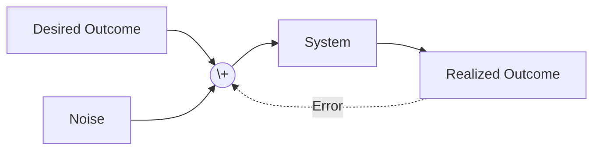
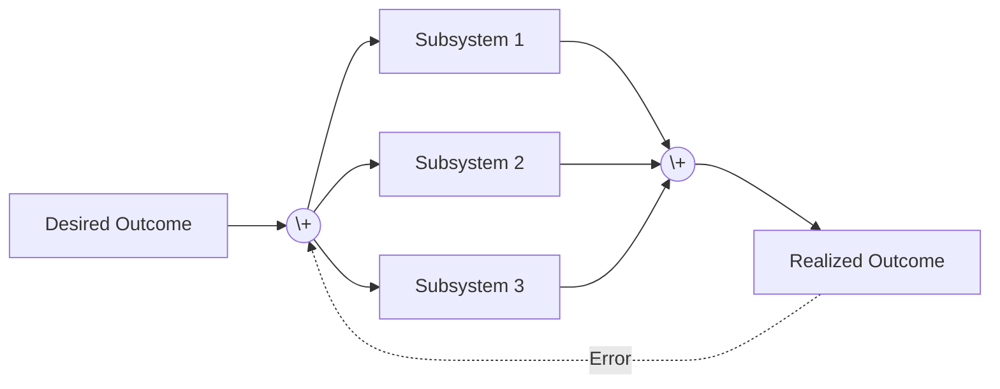

# Taking a Stance
Multi-agent systems, in which several distinct and independent entities interact with one another,
suffer from a key challenge: the complexity of the interactions within the system grows exponentially
as the number of interacting agents increases. This same model maps to organizations and even the
lives of individuals.

As leaders attempting to develop and execute effective strategies, we are often faced with the
need to predict system behaviour and make decisions based on those predictions. As the number of
entities within our strategic model grows, our ability to accurately predict outcomes decreases.

In this post I propose a model for estimating our prediction accuracy, common pitfalls and the impact
they have, and a model which enables us to take appropriate actions regardless.

<!-- more -->

## Naming the Problem
Fundamentally, we can boil our problem down to a simple control system whose goal is to safisty a
desired outcome, where what is desired may vary and the outcome may be influenced by external factors.

```mermaid A diagram showing a simple control system which attempts to safisty a desired outcome
flowchart LR
    Input[Desired Outcome] --> Actor[System]
    Actor --> Output[Realized Outcome]
```

In most practical systems there is usually some form of feedback loop which allows the
system to observe the outcome and adjust its behaviour accordingly - in control system theory this is
known as "Feedback Control".

```mermaid A diagram showing a feedback control system which attempts to safisty a desired outcome
flowchart LR
    Input[Desired Outcome] --> Sum((\+)) --> Actor[System]
    Actor --> Output[Realized Outcome]
    Output -.Error.-> Sum
```

And of course, if this is a real world system then there are going to be sources of noise which influence
both the system's understanding of the desired outcome and its understanding of the true outcome.



Now let's imagine that we string together several of these systems, each of which is attempting to influence
the realized outcome through its own behaviour. In this case, one subsystem's actions influence the outcome
in ways which the other subsystems may be unable to anticipate, and without careful design and orchestration,
the system as a whole can quickly become unstable or struggle to reach the desired state in an optimal manner.



Now consider each of these systems to be a person, a team, an organizational unit, or an aspect of your life
which you are attempting to influence. While we may have an overarching goal for what we wish to achieve, the
ability of our system to reach that goal is fundamentally governed by the interactions of all of the entities
involved.

## Quantifying the Challenge
While this pattern exists within all [complex systems](https://how.complexsystems.fail), there are many cases
where it is possible to achieve the desired outcome with limited difficulty. While it is tempting to chalk this
up to luck or skill, in practice there are quantifyable factors which influence success.

At the heart of this is the [universal scalability law](http://www.perfdynamics.com/Manifesto/USLscalability.html)
which states that a system's relative performance increase as you add resources is governed by three factors:
concurrency ($N$), contention ($\alpha$) and coherency ($\beta$). Concurrency is simply the scaling factor,
contention is the degree to which the system needs to share resources such as money, time, or attention;
and coherency is the degree to which the system needs to agree on an order of operations.

$$
X(N) = \frac{N}{1 + \alpha(N-1) + \beta N(N-1)}
$$

Systems with low contention and coherency can scale almost linearly as resources are added - and this is why
relatively simple processes like people's ability to get out of bed in the morning scale almost perfectly with
the number of people on the planet (up to the point of a bottleneck). Conversely, systems which require a large
number of entities to compete for a small number of resources and where the order of operations is critical are
far harder to scale - which explains why the best restaurants in the world are unable to scale to meet demand.

What you'll regularly find is that systems which appear to scale easily either have a low scaling factor ($N$),
require a limited amount of coordination ($\alpha$), and have very low contention ($\beta$). Translating this
into organizational terms, this means that small companies often benefit from increased innovation efficiency
relative to their larger bretheren, and companies which are able to reduce the need for coordination and allow
teams to deliver independently are far more capable to scale up without losing that efficiency.

This forms the foundation for several organizational design properties, such as the need for clear communication,
delegation of responsibility, separation of concerns, and [Conway's Law](https://en.wikipedia.org/wiki/Conway%27s_law).
Fundamentally, our goal is to enable people, teams, and organizational units to operate with limited need to
coordinate with others and enable them to deliver results without needing to wait on others.

::: tip
We can also map this to personal life decisions by considering our life to be the system and the various
areas we invest in (work, relationship, personal growth, hobbies, friends, relaxing, finance, etc) to be the subsystems
attempting to influence our desired outcome (quality of life). While we all only have 24 hours a day to work
with, we can influence $\alpha$ by aligning these investment areas (work which is a hobby, surrounded by friends, and
with the ability to grow and support yourself financially - for example), and $\beta$ by allowing ourselves to
be flexible about when we achieve our goals (you don't need to be a millionaire by 30, or have found your life partner
by the time you leave university, or be working in Big Tech by the time you're 25, etc).

Conversely, attempting to control when things happen across multiple areas of your life is likely going to lead
to a failure to be able to invest enough time in any of them to excell at them.
:::

### Common Pitfalls
Of course, anyone who has worked in a real-world organization knows that this simply isn't a realistic way
for an organization to operate: people and teams depend on one another and there are finite resources with
which to achieve our goals - which explains why we find ourselves in dysfunctional situations.

The reality is that every complex system is faced with these challenges, it's simply a question of whether
you've scaled to the point where they become visible yet or not. The challenge is that because the
contention and coherency factors result in non-linear behaviour (with $\alpha$ leading to logarithmic gains
and $\beta$ leading to retrograde gains - where things get worse as you scale) it can be particularly
difficult for leaders to predict if they are not already familiar with what is happening.

This leads to several pathologies and decision making pitfalls which further contribute to impeding our ability
to succeed.

#### Centralized Micro-Management
For those familiar with the [CAP theorem](https://en.wikipedia.org/wiki/CAP_theorem) and distributed systems,
you're likely aware that in any distributed system one must trade-off between Consistency/Correctness and
Availability/Latency. Organizational leaders who identify that their organization appears to be unable to
make coherent progress towards the desired goal will often attribute this to a consistency failure induced
by a bias for low-latency (i.e. moving quickly) and will attempt to correct this by introducing additional
top-down process controls which enforce consistency at the cost of increased latency.

::: tip
In the context of one's personal life, this is the equivalent to planning your day in a diary. While it can
help address issues with visibility into tasks in cases where this is your primary challenge, it can also
quickly lead to a situation where you become overwhelmed with the number of tasks you need to complete in the
time you have available. This problem is exacerbated significantly if you are unable to accurately predict
how long each task will take, or if you are unable to accurately predict how much time you will have available,
as this further drives up the coherency factor ($\beta$) as you attempt to rearrange tasks around non-negotiable
engagements.

Ultimately, you may choose to simplify the problem by removing non-negotiable engagements from your life, which
reduces the coherency factor ($\beta$) by allowing you to rearrange tasks more freely; but the cost of doing so
is often that the first non-negotiable engagements you remove will be the ones where people are most likely to
be understanding in the short term - namely close friends and family.
:::

In practice, this often improves convergence on a single strategy at the cost of increasing both resource
contention ($\alpha$) and ordering constraints ($\beta$) which in turn harm the organization's ability to
scale. In cases where the organization's primary challenge is not a lack of scalability but rather a lack
of alignment, this can and does work. Indeed, this is why this practice works so well in smaller teams and
organizations (where $N$ is small enough that scaling factors are unlikely to be the largest contributor to
success) but it also explains why these same practices, when applied in larger organizations, often lead to
further stagnation and dysfunction.

Contrast this with large organizations which define and socialize clear principles/values, enforce adherence
to these through cultural norms, and allow teams significant leeway to approach problems and delivery as they
see fit with significant negative ramifications for those who fail to adhere to the guiding principles. The
result is limited contention ($\alpha$) and coherency ($\beta$) factors (effectively reducing this to the
minimum required for the team to meet their goals). When combined with an expectation that teams maintain high
efficiency (and incentives to this effect), there is additional pressure to keep $\alpha$ and $\beta$ low.
While this approach may not be as effective in a small organization where the primary challenge is alignment,
it is far more effective in larger organizations where the primary challenge is scalability (and where alignment
is a much easier problem to solve through expert leadership, hiring, and planning processes).

#### The Plurality Problem
Another challenge faced in large organizations is the idea of "don't put all your eggs in one basket".
While this is a sound strategy when it comes to managing risk in a context where failure aversion is more
important than cost management, it requires very careful consideration when attempting to scale.

Specifically, the challenge with implementing multiple strategies in parallel is that, unless one is
careful to isolate the strategies from one another, they will often end up competing for the same
resources and thus increasing contention ($\alpha$) in the system. Placing deadlines on delivery, which
is a common practice in organizations, serves only to further increase contention ($\alpha$) and also
increase coherency ($\beta$) as teams are forced to align their delivery schedules.

::: tip
In one's personal life, this is the equivalent of attempting to maximize your work, relationship, personal growth,
hobbies, etm. all at the same time. While investing in all of these areas is possible, they all compete for a
single shared resource: your time (i.e. $\alpha \gt 0$). Pair this with the fact that each of these areas has its own time restrictions,
and you will quickly find that $\beta$ is non-zero as well.

To maximize your achievements, the only practical solution is to reduce contention ($\alpha$) by not prioritizing
many of these areas, and to keep ordering requirements to a minimum ($\beta$) by avoiding areas which bring
their own constraints (relationships, friends, social hobbies, etc).
:::

The net result is that by attempting to spread your risk across multiple strategies, you end up increasing
the likelihood of failure across all of them due to an inability to scale. We observe the same in organizations
which permit a large degree of variance in their technology adoption and which permit teams to develop their
own unique solutions to common problems. In both cases, teams spend significant time building and maintaining
solutions which do not provide direct business value, and the long-term support of these requires significant
coordination and alignment (security requirements, compliance, functional/reliability enhancements,
standards adherence, and planning costs associated with doing so).

Contrast this with organizations who make a clear decision about how they seek to address a problem,
communicate this, and invest the resources necessary to align the organization around this approach.
Assuming appropriate investment in the common solution, we can expect to see an increase in contention
($\alpha$) and a reduction in coherency ($\beta$) as teams no longer need to coordinate to solve a
diverse range of unrelated problems and can instead bound this problem to the cost of implementing
the common solution. In other words, the cost of incremental improvement is amortized over the number
of teams using the solution, and assuming that integration costs are lower than the cost of building
and maintaining a unique solution, the organization will benefit from a reduction in overall costs and
a boost to its scalability.

#### Confusing Effort with Impact
At its most fundamental, the Universal Scalability Law is a statement about the relationship between
effort and impact. As we increase effort ($N$) we expect to see a corresponding increase in impact,
but the USL shows us that this is not always the case. In fact, the USL shows us that as we increase
effort with $\beta \gt 0$ we can expect to see a reduction in impact as the system becomes less efficient
(beyond a certain point).

This is the pitfall tackled in [Eli Goldratt's "The Goal"](https://en.wikipedia.org/wiki/The_Goal_%28novel%29)
in which he discusses the Theory of Constraints and the idea that the most effective means of improving
a system is to identify and address bottlenecks (reducing $\alpha$) and implementing appropriate buffering
strategies which leverage backpressure to provide loose-ordering between entities (keeping \$beta$ low).

The challenge here is that, as a leader, the people you are responsible for are not in fact incentivized
to deliver impact. Instead, they are incentivized to convince you that they have delivered the desired
impact. This crucial difference, paired with the fact that most of the impact you care about is the result
of dozens or hundreds of loosely coordinated systems, means that we often settle for measurements of effort
as an acceptable proxy - and we're all too happy to delegate the responsibility for selecting and measuring
impact to the people doing the work.

The solution here is to decouple the reporting responsibilities from delivery, and to measure promises
both on the provided and consumer sides (i.e. SLIs on both the server and client). When done appropriately,
it becomes possible to identify where your organization is busy but not delivering impact (you will see
lots of indicators of impact from the provider, and consumers will report limited benefit).

## A Model for Effectiveness
As we become more aware of the challenges faced by complex systems, it is common to hear people
adopt an "it depends" attitude towards decision making. This stems from a recognition that there
is no perfect solution, but rather that the best solution is one which is tailored to the specific
environment it operates in and that an approach which has worked well previously may fail in a
different context.

When employed at scale, this approach leads to significant variance in the systems we build, as
it becomes possible for small differences in priority/assumption to lead to significantly different
implementations which all satisfy similar core requirements. When paired with incentive structures
which reward effort and struggle to quantify valuable impact, we end up perpetuating a
[Not Invented Here](https://en.wikipedia.org/wiki/Not_invented_here) mentality which can
rapidly calcify this variance.

As leaders, it is our job to see beyond the validity of these discrete approaches and look instead
to the effectiveness of the system as a whole. This requires us to acknowledge that it is possible
for an entity to both be fit for purpose, and unsuitable for the ecosystem we are building. In such
cases, it is necessary for such entities to either adapt to the ecosystem or to relocate to an
ecosystem aligned with their nature (and that this does not imply anything about the entity's capabilities
or quality).

We achieve this not just by looking at the state of the world as it exists today, in which these
systems are often self-sustaining and well justified, but rather by looking at the trajectory of
these systems and the impact they will have on the system as a whole over time. When looking at
long-term impacts, it is much easier to identify entities which actively destabilize or harm the
ecosystem even if they are currently delivering value.

::: tip
This can also be applied when considering people. While much of modern society falls into the trap
of assuming that their local morality is the one true definition of right or wrong, with time we
can learn to understand that everyone has their own reasons for acting the way they do and that
most do so from a place of good intentions. By understanding each person's reference, we can accept
their actions as being valid within their own context and easily forgive them.

When taking a broader view of the role that those people play in your life over time, you are
likely to find that those whose actions are justified in an incompatible context are likely to
destabilise or harm your own quality of life over time, even if they are currently valued.
:::
